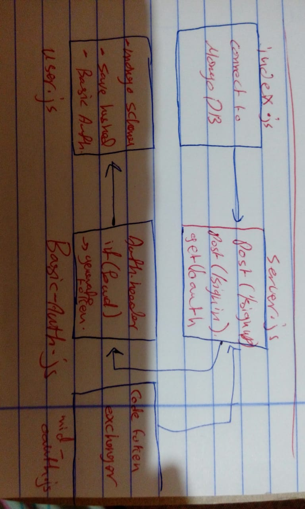

# LAB - Class 14

## Module 3 Final Project: API Server

### Author: Saja Swalgah

### Links and Resources

- [submission PR](https://github.com/Saja-401-advanced-javascript/authenticated-api-server/pull/1)

### Setup

#### `.env` requirements (where applicable)

- `PORT` - 9000
- `MONGODB_URI` - mongodb://localhost:27017/LAB11
- `tokenServerUrl`=https://github.com/login/oauth/access_token
- `remoteAPI`=https://api.github.com/user
- `CLIENT_ID`=36f6d35de7fc8aab66a8
- `CLIENT_SECRET`=760c81885172625b664b8d368b69a15a10b909b5
- `API_SERVER`=http://localhost:9000/oauth

#### How to initialize/run your application (where applicable)

-`npm start` || `nodemon`
- localhost/9000

#### UML

